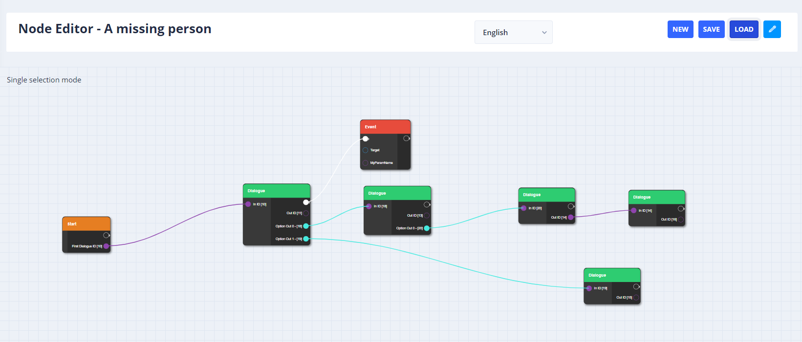

# Welcome to StoryTime!

## StoryTime

**StoryTime** is a data management web-based software, an open-source Software as a service (SaaS) whose goal is to manage data for Unity3D, Unreal (and maybe in the future Godot). StoryTime will also provide packages for Unity3D and Unreal where user can use components that has built-in functions to communicate with the database.

### Features

StoryTime allows users to edit data that are normally stored as raw JSON. It also supports creating stories or craftables in a node editor style. Each table contains the data and metadata that defines the table. Users can also have access to versioning to see all the changes! Everything is stored locally/online and easy to adapt in in-house environments.

### About / Why

It started as a school project where designers wanted to work with spreadsheets to create game data, but this became tedious, hard to manage, and hard to collaborate in. So, I wanted to have an application that is able to edit data similar to spreadsheets, but also structured and indexable. Aside from managing data, I also wanted to have plugins where I provide integration in Unity or Unreal where designers can immediately use their data in their games. Lastly StoryTime also wants to provide easy building block for large complex components such as inventory, crafting or dialogues systems.

## Useful Links

* [Unity package](https://github.com/vamidi/StoryTime-UPM)
* [StoryTime web application](https://github.com/vamidi/StoryTime)
* [Our progress](https://open.codecks.io/storytime)


[getting-started.md](quick-start/getting-started.md)



[setup.md](quick-start/setup/setup.md)



[tutorials.md](quick-start/tutorials.md)



[faq.md](vamidicreations/faq.md)



[roadmap.md](vamidicreations/roadmap.md)



Join our StoryTime [Discord server](https://discord.gg/SgJ8X5s)!

