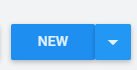
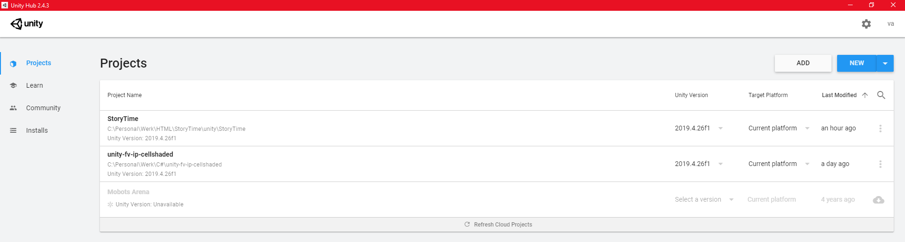
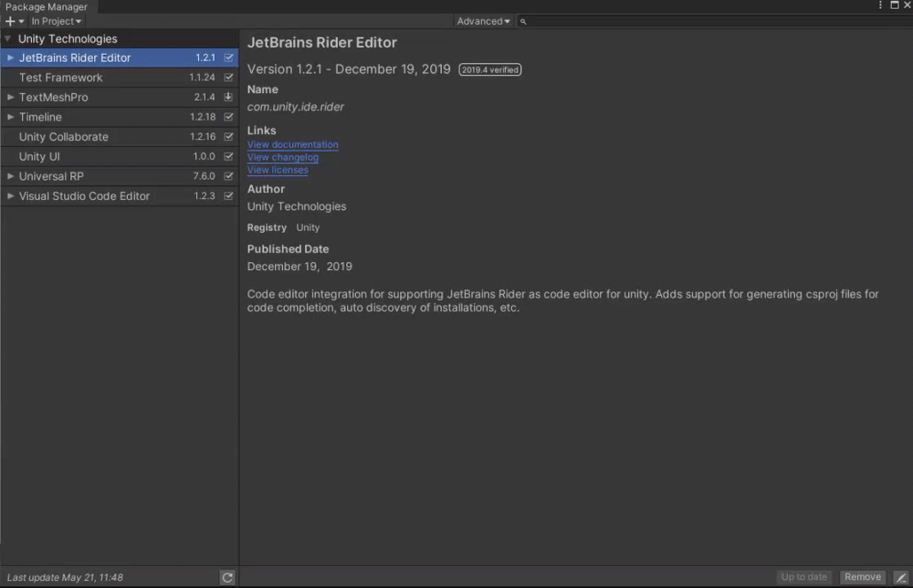

# StoryTime Unity Package
A Unity package that can communicate data with StoryTime. This package also provides components that users can use to 
create RPG games.

## Prerequisites
* You must have git installed on your machine.
* Package(s) from GitHub:
	* ["com.marijnzwemmer.unity-toolbar-extender": "1.3.1"](https://github.com/marijnz/unity-toolbar-extender),
* Package(s) from Unity asset store.
	* [Dotween](https://assetstore.unity.com/packages/tools/animation/dotween-hotween-v2-27676)

For more information check out our [Documentations](https://valencio-masaki16.gitbook.io/storytime/)
	
## Getting Started
> **Make sure if you use an existing project that is has Universal Render Pipeline (URP) enabled.**

To get started, you'll need to install StoryTime in your Unity project. StoryTime is available as a package via OpenUPM,
and via direct download as a `.unitypackage` file.

### Quick Start: Direct download
To install StoryTime via direct download, follow these steps:

* Go to the [releases page](https://openupm.com/packages/com.vamidicreations.storytime.html), and download the `.unitypackage`. 
* Open the `.unitypackage`, and import its contents into your project.

StoryTime will be installed into the `StoryTime` folder in your project's Assets.

### Quick Start: OpenUPM

To install StoryTime via OpenUPM, follow these steps:

* Install [`openupm-cli`](https://openupm.com/#get-started). 
* Open a terminal, and navigate to your project's folder.
* Run the following command: `openupm add com.vamidicreations.storytime`

StoryTime will be installed into the `StoryTime` folder in your project's Packages.

### Quick Start: Unity Editor

To install StoryTime via Unity3D, follow these steps:

* Open Unity Hub and select either new  or click an existing project from
  the list.
  
* Once Unity is opened go to the toolbar and click on `Window > Package Manager`.
* Press the plus `+` in the top left corner and select `Add package from git URL`. Paste `https://github.com/vamidi/StoryTime-UPM.git` 
and click add.
  
  > **If you have `warning CS1030` you can fix this by going to `File > Build Settings` and select x86_64 architecture.**
  
  
* Once everything is installed we have to create a config file to start communicating to your [StoryTime](https://github.com/vamidi/StoryTime) server.
* You can create a config file by right-click anywhere in your asset folder (i.e `Assets > Settings`) and go to `Create > DatabaseSync > Configurations > Config File`. 
> **ATTENTION - If you name your config different than the name provided add it to the .gitignore or else you will push sensitive data.**
  You can just use the standard name provided or create your own.
* Then go to `Window > DatabaseSync > Global Settings`.
* Drag your config file into the first field and more fields will pop up.
* Fill in the necessary fields in order to communicate. They are listed below.

| Variable                	| Default Value                          | Description                                                       						|
| ----------------------  	| -------------------------------------- | ---------------------------------------------------------------------------------------- |
| Database URL          	|                       				 | The URL of your StoryTime server                                  						|
| Project ID        		| YOUR_PROJECT_ID   					 | The project you want to retrieve the data from. (Located in the StoryTime web editor)	|
| Email    					| YOUR_EMAIL_LOGIN                       | Your StoryTime login credentials.                                 						|
| Password   				| YOUR_PASSWORD_LOGIN                    | Your StoryTime login credentials.            				 	 						|
| Data Path     			| YOUR_UNITY_DATA_PATH                   | The location that StoryTime is going to store all the data                   			|

* After filling all the necessary fields you can start syncing all the data.
* Look at the documentation for more information on getting started with the components.

## License

The StoryTime is open-sourced software licensed under the [Apache 2.0](./LICENSE)

