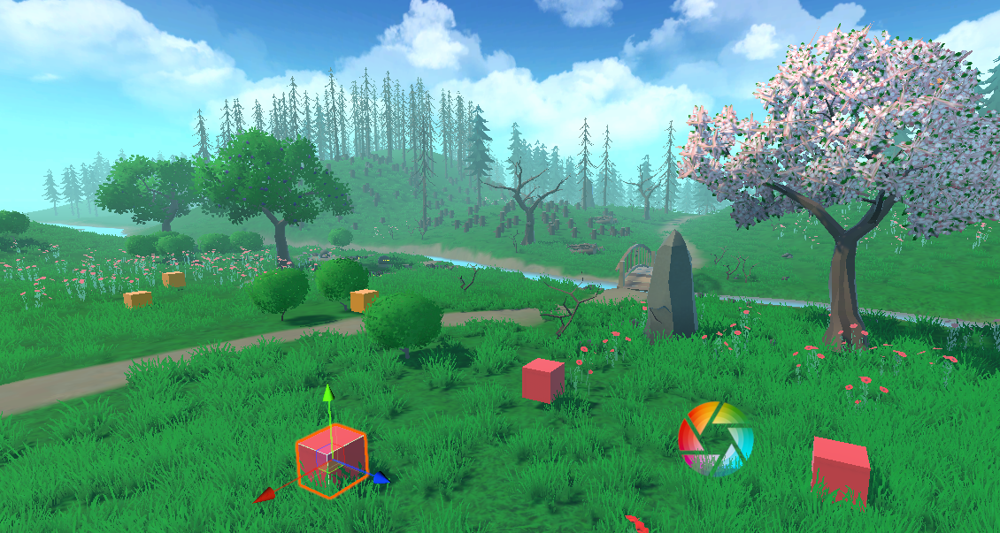

# Items

**Looting** is an integral part of any RPG game and is one of those things game designers never stop tweaking during the development of the game, because its relies on player progression and a misplaced item could make the Player overpowered at the beginning of them game.

In order to start with creating items we have to start with creating items in the StoryTime editor.

