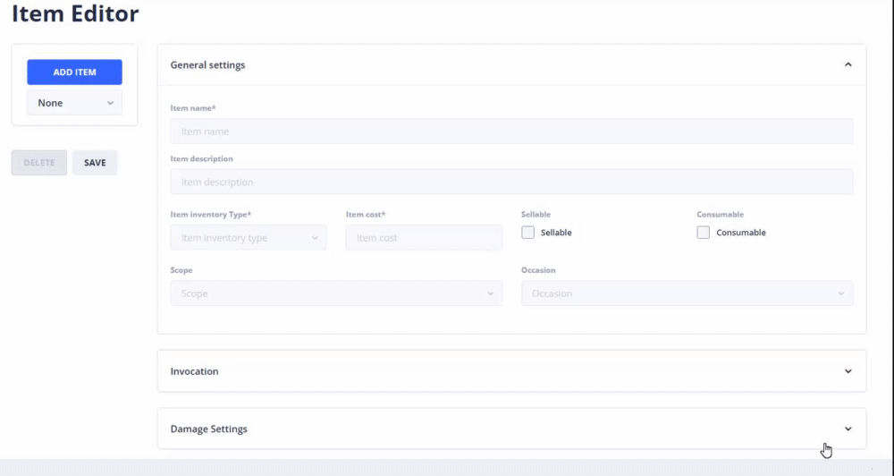

# Items: Editor

## Item creation

Go to your own StoryTime editor and go to `Projects` -> `Select Project` -> `Game Editor` -> `Items` -> `New Item`.


Warning: Damage fields should only be changed in the Damage section of the Game editor in order to get the proper information about each of the fields.


Item information that you can fill out are defined as followed.

| Field                     | Information                                                                                                              | Type            | Default            |
| ------------------------- | ------------------------------------------------------------------------------------------------------------------------ | --------------- | ------------------ |
| ID                        | Id of the document                                                                                                       | Number          | `AUTO_INCREMENT`   |
| Name                      | Name of the item                                                                                                         | Language Object | `""`               |
| Description               | Description for the item                                                                                                 | Language Object | `""`               |
| Damage parameter          | The parameter what we are you to use for `Damage`, `Recover` or `Drain`                                                  | Reference       | `9007199254740991` |
| Damage type               | The type of damage we are going to give to the player _(can also recover)_                                               | Reference       | `9007199254740991` |
| Effect type Primary value |                                                                                                                          | Number          | `0`                |
| Effect type               |                                                                                                                          | Reference       | `9007199254740991` |
| Formula                   | Formula we are going to use to calculate the output                                                                      | String          | `""`               |
| Repeat                    | How many times this item can be used during battle.                                                                      | Number          | `0`                |
| Sellable                  | Whether the item is sellable.                                                                                            | Boolean         | `false`            |
| Sell value                | The price value of the item.                                                                                             | Number          | `0`                |
| Speed                     | How fast we can use this item. Helpful for turn-based games where you want to define on how fast this item will be used. | Number          | `0`                |
| Success rate              | The rate in `%` how much we successfully can use this item.                                                              | Number          | `0`                |
| Type                      | Whether you can `Cook`, `Craft` or `Use` this item.                                                                      | Reference       | `9007199254740991` |
| Variance                  | How much `%` we can be off when the output is calculated.                                                                | Number          | `0`                |

Once we have created the item we can go on to Unity or Unreal engine 4.
