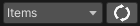
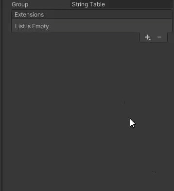

# Items: Engine

Unfortunately in our JSON extension, we are only able to load data from one key in your table. In the future, we are going to make sure we are able to support more keys for one table.


In StoryTime, we have made sure you don't have to link every localization table with the different `ScriptableObjects` you create. That is why we've provided a source where we look up predefined tables. Make sure you name your tables accordingly to the information displayed down below to make this feature work.&#x20;


| Table             | Table name          |
| ----------------- | ------------------- |
| Item names        | `Item Names`        |
| Item descriptions | `Item Descriptions` |

### Localization



#### Localization

1. Open your Unity3D project of choice.
2. Sync your item at the top by clicking on sync. _**(Sync all if you need the rest as well)**_
3. Make sure you have loaded the localization settings and locales (see [Localization](../../../storytime/storytime/systems/localization.md)).
4. Once configured go to `Window` --> `Asset Management` --> `Localization Tables`
5. Create two new tables `Item names` and `Item Descriptions`.
6. Place them wherever you want. I recommend placing it under the folder `Localization` -> `Data` -> `Item management` -> `Names/Descriptions`&#x20;
7. Inspect both the Item names and Item descriptions and add the JSON extension to the group section.&#x20;
8. Finally, click pull to pull the data from the JSON file.

















[Broken link](broken-reference)

