# Setup

### Download


Ignore clone steps if you have downloaded the latest [release](./#download) of StoryTime.


Windows and MacOS users can install StoryTime by going to [release](https://github.com/vamidi/StoryTime/releases) page. Click and download the latest version of your operating system. The StoryTime application comes with a in-built server to communicate between the game engine and StoryTime.&#x20;


[app-installation.md](app-installation.md)


### Installation


Your game engine of choice where you can receive JSON from the API.

A Firebase database(free or blaze tier) or an SQL database (PostgreSQL, SQLite or MSSQL).

A web host to communicate with Firebase and return JSON data to your framework/engine.


### NPM install

```shell
# clone our repo
git clone https://github.com/vamidi/StoryTime.git

# change directory to our repo
cd storytime

# install the repo with npm
npm install
```

### Firebase

* If you don't have a Google account create it.&#x20;
* If you already have an account go to the [Firebase Console](https://console.firebase.google.com/u/0/). Login and follow the steps to create a new project.

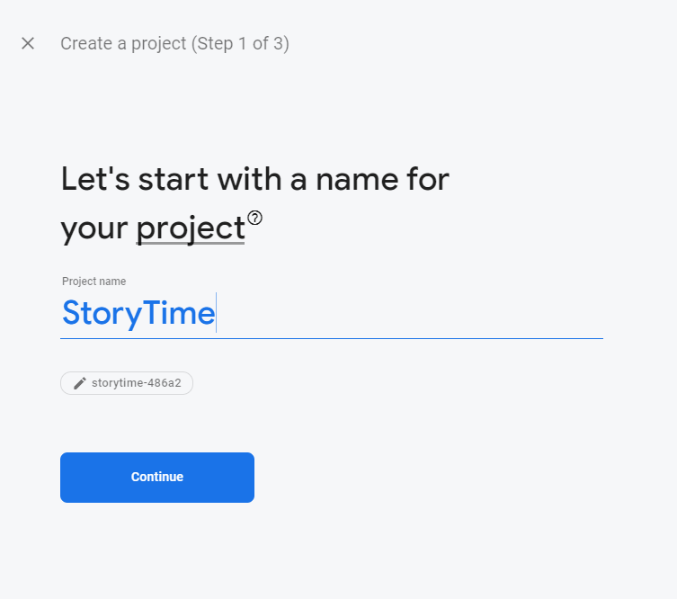

* Fill in the name of your project. Once filled click to continue.

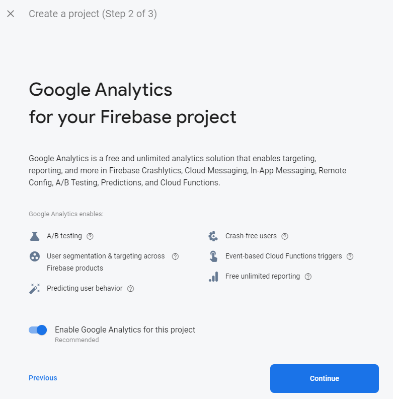


These steps are optional, but I would recommend using them if you want to receive analytics for your app.


* Enable Google Analytics for this project if not already enabled and click continue.

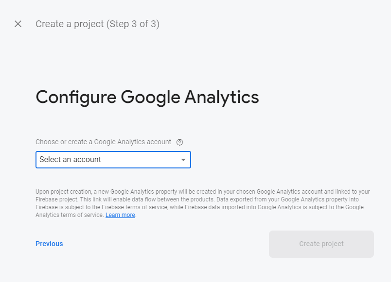

* Select an account to use Google Analytics for, if this does not exist create one.&#x20;
* Once finished click "create project".

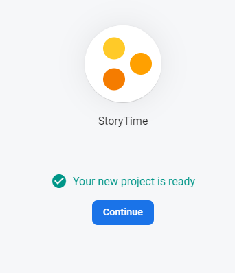

* Once your project is generated, press "continue" to go to the home screen.

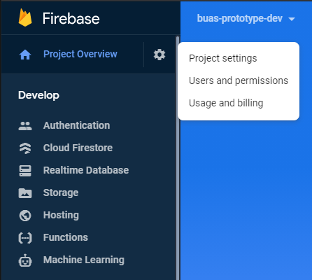

* In the top left corner click on settings ⚙️ and click project settings to get your credentials.

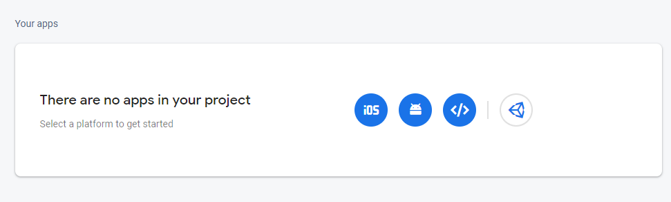

* In the General tab when you scroll down you see that you do not have any apps in your project. Click on web app  and register your app.

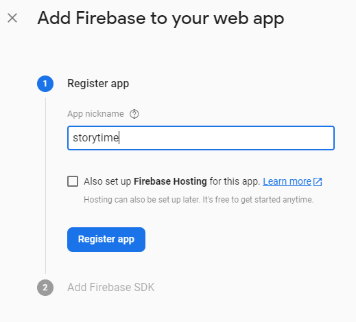

* Fill in the name of your app, you can keep Firebase Hosting unchecked and click register app.&#x20;

> The config that you see will be for your firebase credentials. Keep them safe!

* Once you have registered your app click to continue back to console, and you will see your credentials.&#x20;

> You can also use the credentials from the registration form

### Authentication

> For StoryTime to work you need users, so we have to add it now to the firebase project.

* Go back to the firebase console, Under the Build category click on authentication.

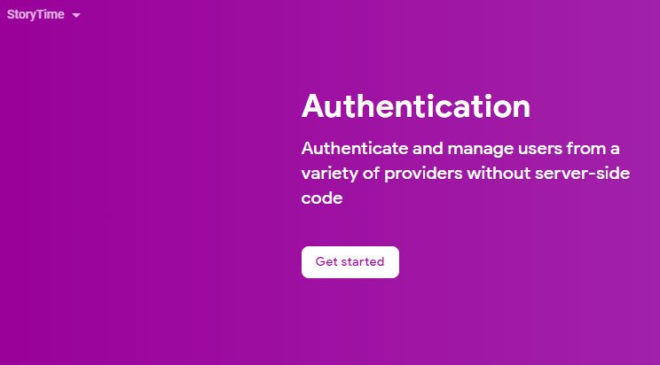

* Click on `Get started` to continue to the authentication page.

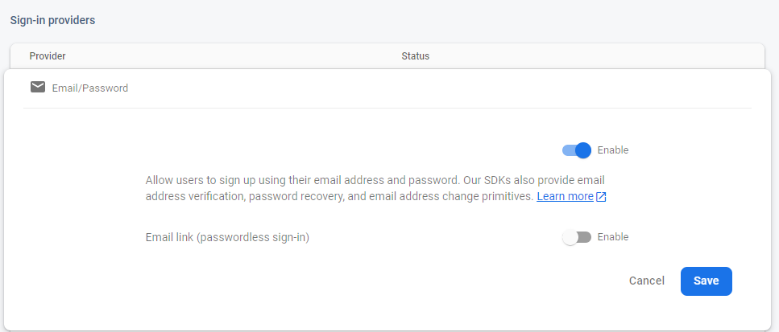

* In the sign-in methods tab click on email/password and enable it (make sure to save it in order to see the changes).
* Go to the users tab

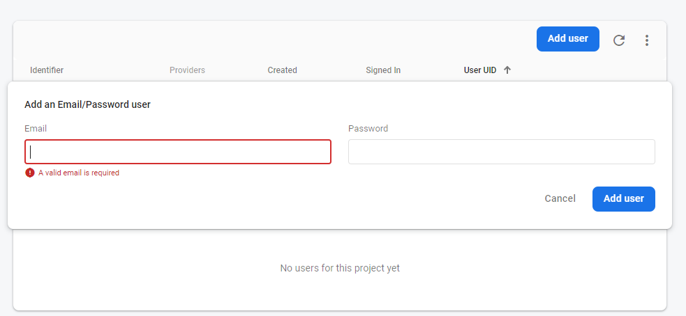

* Add a new user.

> Can be any kind of email as long as it is a valid email. The password can be anything you want

### Firebase Database

> For StoryTime to work you need to use Firebase realtime database, so we have to add it now to the firebase project.

* Go back to the firebase console, unfold build on the left side panel and click realtime database.

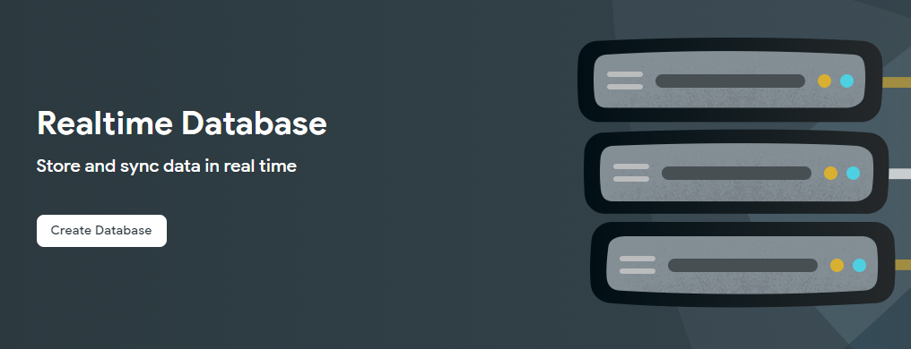

* Click on Create database to continue setting up the database.

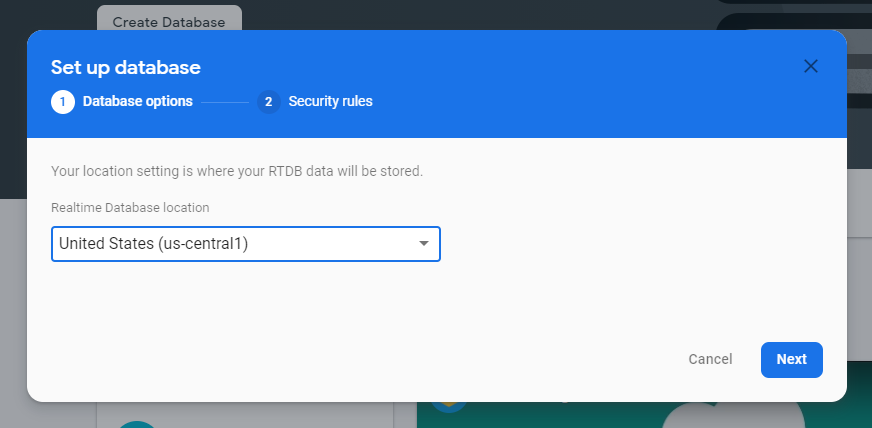

> Choosing the database that is close to your location might help with the connection to the database

* Choose the location where you want to store your database. You can choose what you prefer, I prefer United States.&#x20;
* Click next to continue.

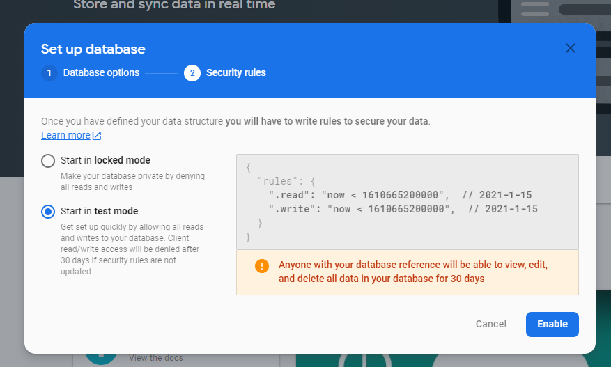


Database rules can be changed later!


* For development purposes I recommend choosing test mode, this will give read write access until the timestamp is surpassed (30days).
* Click enable to continue.
* Once the database is created you are set and ready to configure StoryTime.

### Configuration

**StoryTime** uses environment variables to configure firebase automatically. The \[.env] file contains all the environment variables used in **StoryTime**.

> the `.env` should not be deleted or renamed, because the installation depends on this file.

> If you are using separate environments make sure you create multiple apps with different firebase credentials and different `.env.[YOUR_ENVIRONMENT]` files.

* Create a file in the root of the project, name it `.env` and copy over the content from the `.env.example` file.

The following table describes the configurable environment variables.


Variables with an asterisk are optional


| Variable                  | Default Value                        | Description                                                                |
| ------------------------- | ------------------------------------ | -------------------------------------------------------------------------- |
| APP\_NAME\*               | "StoryTime - Dev"                    | The name of your app                                                       |
| FIREBASE\_API\_KEY        | YOUR\_API\_KEY                       | The API key firebase uses to connect to the database.                      |
| FIREBASE\_AUTH\_DOMAIN    | YOUR\_AUTH\_DOMAIN                   | Firebase auth domain.                                                      |
| FIREBASE\_DATABASE\_URL   | YOUR\_DATABASE\_URL                  | Firebase database url to grab data from the database.                      |
| FIREBASE\_PROJECT\_ID     | YOUR\_PROJECT\_ID                    | Firebase project id.                                                       |
| FIREBASE\_STORAGE\_BUCKET | YOUR\_STORAGE\_BUCKET                | Firebase storage bucket url.                                               |
| FIREBASE\_MESSAGING\_ID   | YOUR\_MESSAGING\_ID                  | Firebase messaging id.                                                     |
| FIREBASE\_APP\_ID         | YOUR\_APP\_ID                        | Firebase app id.                                                           |
| FIREBASE\_MEASUREMENT\_ID | YOUR\_MEASUREMENT\_ID                | Firebase measurement id.                                                   |
| PRISMA\_SECRET            | YOUR\_RANDOM\_PRISMA\_SECRET         | Random secure token that we check in order to make calls to the prisma API |
| PATH\_TO\_CONFIG          | ./PATH/TO/YOUR/CONFIG.JSON.FILE      | Path where the config.json file should be made.                            |
| REL\_PATH\_TO\_CONFIG     | ./REL\_PATH/TO/YOUR/CONFIG.JSON.FILE | Relative path from the main.ts to the config.json file.                    |

* Go back to Firebase console and in the top left corner click on settings ⚙️ and click afterwards on `project settings` to get part of the credentials needed.&#x20;
* Scroll down and copy over apiKey, authDomain, projectId, storageBucket, messagingSenderId, appId and measurementId (optional), to the corresponding variables in the `.env` file

```javascript
var firebaseConfig = {
	apiKey: "[FIREBASE_API_KEY]",
	authDomain: "[FIREBASE_AUTH_DOMAIN]",
	projectId: "[FIREBASE_PROJECT_ID]",
	storageBucket: "[FIREBASE_STORAGE_BUCKET]",
	messagingSenderId: "[FIREBASE_MESSAGING_ID]",
	appId: "[FIREBASE_APP_ID]",
	measurementId: "[FIREBASE_MEASUREMENT_ID]"
};
```

* Go back to the Firebase console and unfold `build` and click on realtime database.

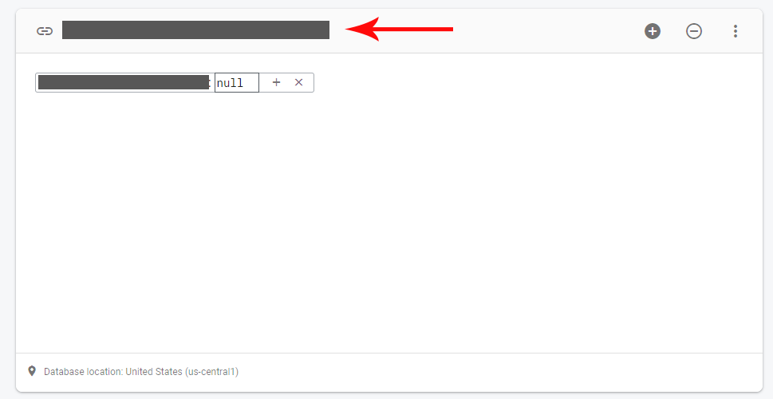

* Copy the url and place it in the `.env` file under the variable `FIREBASE_DATABASE_URL`.

### Development

* When all firebase variables are filled in, you are able to start the server to see everything in action.
* `npm run all` will start the local dev environment and the server to communicate with the game engines.

```bash
# start the server
npm start

# if you want to start the server 
# and the communication server between the engine and StoryTime
npm run all

# if you're in China use cnpm
# https://github.com/cnpm/cnpm
```

* Go to http://localhost:4200 in your browser
* Go to http://localhost:300

### Production


Ignore build steps if you have downloaded the release of StoryTime.


```bash
# Build for production
npm run build:prod
```

* Fill in the right credentials in `assets/data/config.json` to make API calls.&#x20;
* Copy over dist, or the contents of the release folder to your server where you want to run StoryTime from it from.
* Copy over the server folder to communicate with Firebase through NextJS (Vercel framework) **WIP**.
