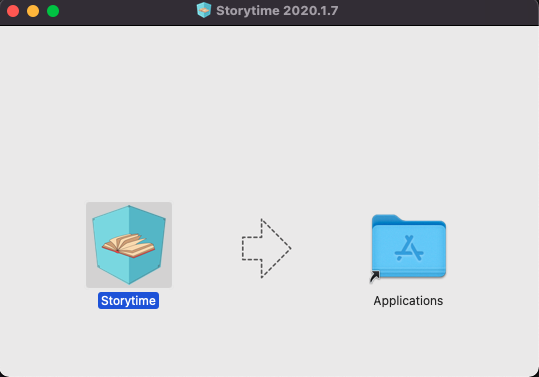
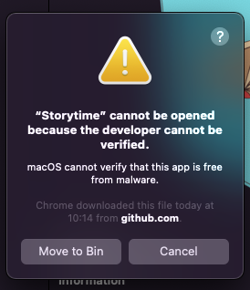
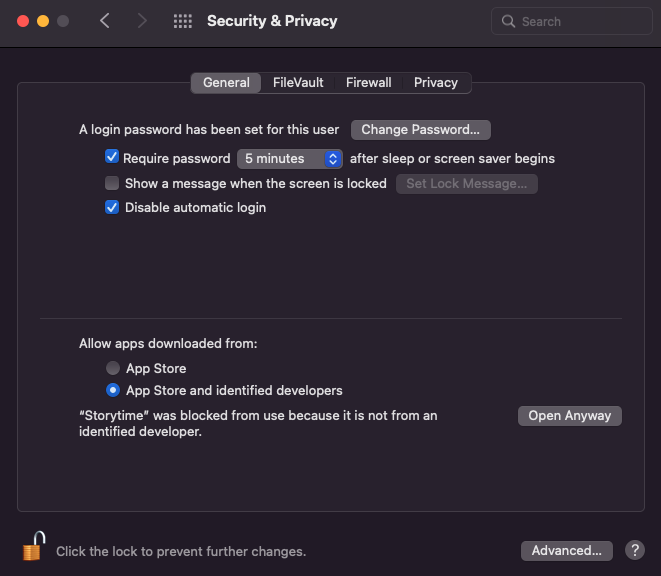

# App installation

### Installation

Go to the release page and download the latest version of StoryTime. Make sure you have your credentials with you to fill in.&#x20;

#### Windows

#### MacOS

If this message pops up, it means you have to allow developers outside the app store.

* Click cancel.
* Go to System preferences --> Security and Privacy --> General tab.
* Click **"Open anyway"**

* Enter your computer username and password or fingerprint (Fingerprint Macbooks only), then select **"Unlock."**

### Setup

#### Windows

#### MacOS

* Once StoryTime is installed open up the app and fill in your credentials.
* If you choose local server make sure you fill in the `env.example` file in the Next folder and rename it to `env`.
* From there the server will start automatically when you open up StoryTime.
