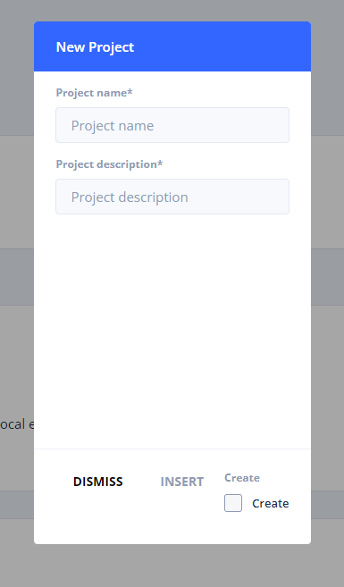
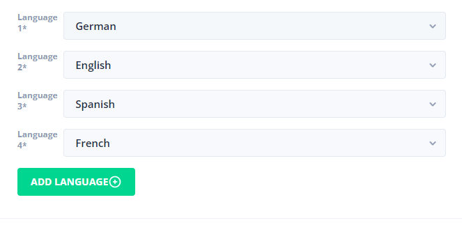
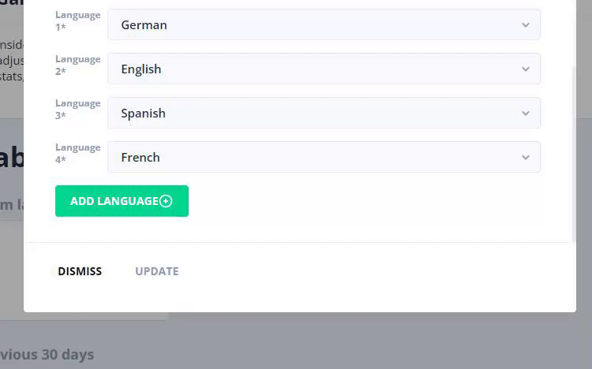

# Projects

### Introduction

Projects hold information about your migrations, languages, tables, columns, and users.

#### Create project

When you first open up StoryTime you will have no project to start with.

* Click on projects on the navigation on the left side.
* Click either on the plus side or "add project" at the top.



* Add project name
* Add project description
* Click on insert. If you want to create a new project immediately after you can check the create box to stay on the form.

Congratulation, you've created a project in StoryTime.

#### Add language

In order to support multiple languages in your game, you have to add them to your project in order to use them.




If your country is not listed, send us a message to add it to the list.


* Click on "Add language" to add a language to your project.
* Select the country you want to support.



#### Adding users


This feature is still a work in progress.



#### Migrations


Migrations are only available in development mode.


Migrations are functions that can be executed on a project, or table. These functions are meant to make your life easier instead of going to the Firebase console and changing data in the database. To create your own migration, go to `src/app/_core/data/state/projects/migrations/project.migrations.ts` and add a new function.

```typescript
async function myAsyncFunction(asset: Project, args?: any): Promise<boolean>
{
	if(args !== null)
	{
		// Do something with asset.
		return true;
	}
	return false;
}
```

* Add your function to the `export const migrations: IPipelineSchedule[]` variable.
* `validateFn` determines a validation process first before continueing.

```typescript
{ name: 'My awesome function', callbackFn: myAsyncFunction, validateFn: async () => true, force: false },
```

