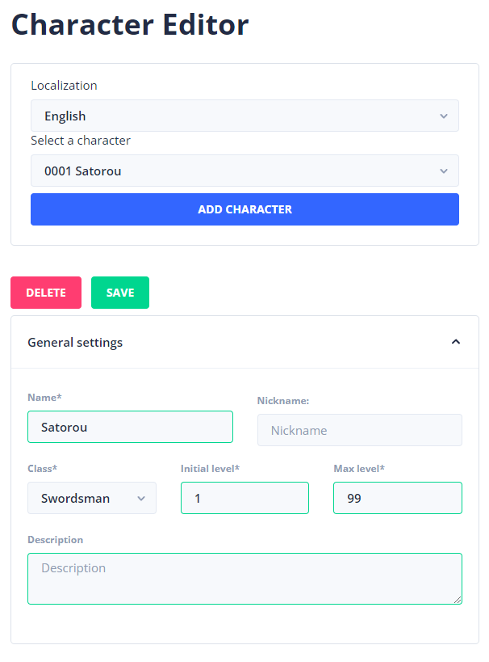

# Character editor

The character editor enables you to create characters with classes and equipment.

* You can create a character by pressing on the "add character button"&#x20;
* You can delete a character.
* You can change the character details.
* You can add equipment to the character.
