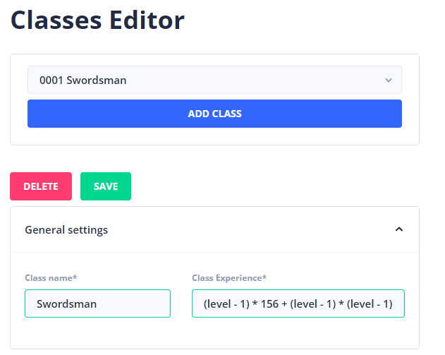
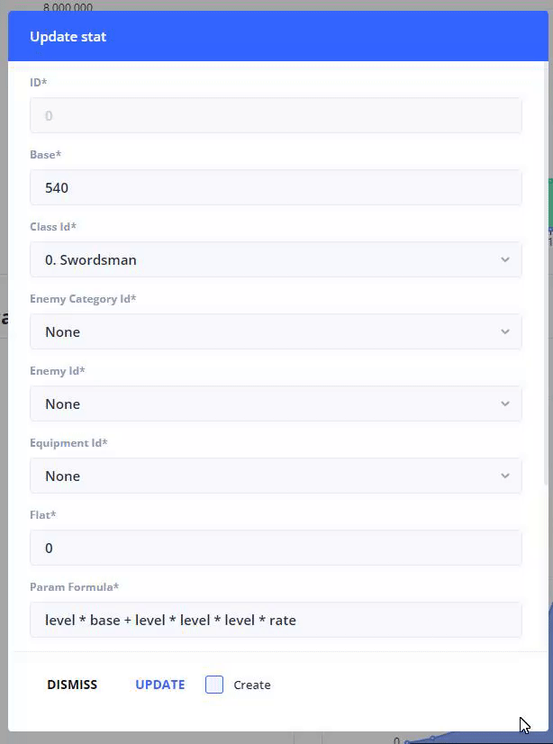
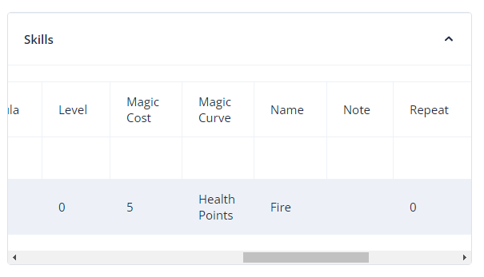

# Classes

In most roleplaying games you have the ability to choose a class that fits your personality. In StoryTime, we enable you to do the same thing. We have taken the grand scheme of how classes are made.&#x20;

First off we have the name of the class and the experience formula. This formula is just a simple math expression.&#x20;

$$
(level - 1) * 156 + (level - 1) * (level - 1) * (level - 1) * 1.265 - 3
$$

In StoryTime, we use an expression library to calculate the experience and the experience needed.&#x20;

Just like the enemies you can give stats curves to classes as well. Here is an example of the health stat of the class.

In the editing window, you can adjust the values such as the stat curve, which uses a different formula.

$$
level * base + level * level * level * rate
$$

* level - current level of the class.
* base - the base value of the class.
* rate - the rate on how fast the exp curve grows.

You can also assign skills to a specific class. (see [skills.md](skills.md "mention"))

