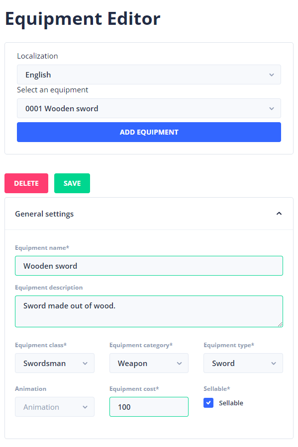
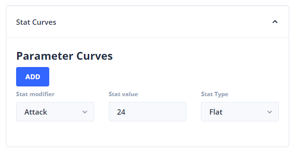

# Equipment

When creating your characters and assigning classes to them, you might also want them to have different equipment. Like every roleplaying you have armor that you can give to specific characters. In StoryTime, we have created a system that gives you just that.

