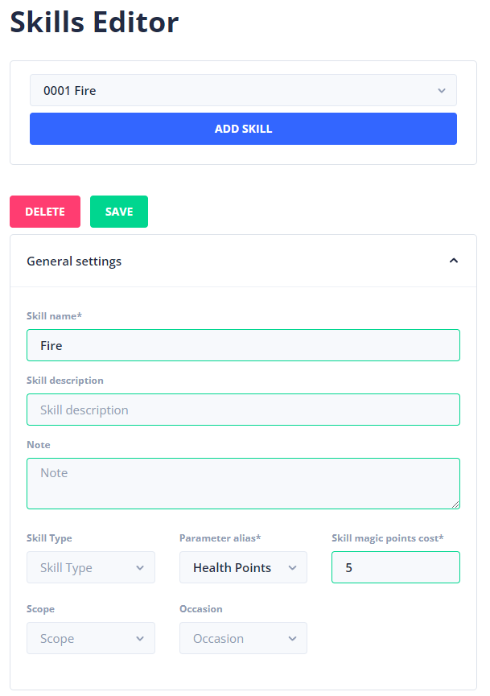
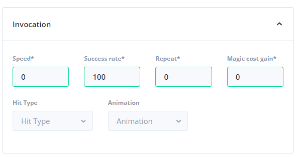

# Skills

To differentiate classes from each other you need to have skills attached to them. This makes them show apart. In the skills editor, you are able to add skills to different classes of your choosing.

In the general section, you can assign different values to your skill.

* Skill type determines what kind of skill it is. (WIP)
* Parameter alias is which parameter we need to use to deplete from.
* Skill magic cost is for how many points this specific skill cost.
* The scope is for how many enemies we can attack. (WIP)
* The occasion is for how many times the skill will hit.

Moving over to the invocation section. Here you can specify the following.

* Speed is how fast you can attack. In a strategy game, this is specific on how early this attack can be used (i.e "Quick Attack" in the _Pokémon games_.)
* The success rate is the percentage of whether the skill will hit.
* Repeat repeats the attack.
* Magic cost gain gives back a portion to a stat (WIP).

In the damage settings, you can adjust the damage properties of that skill.

* DMG parameter is for which parameter we are attacking on.
* Damage type is whether the attack will heal, drain or apply damage to you.
* The formula is for a specific way of applying "damage" (WIP).
* The variance determines how much off we can be from the calculated attack. This will help you generate random values.
* Critical hits are for whether this skill can critically hit.
