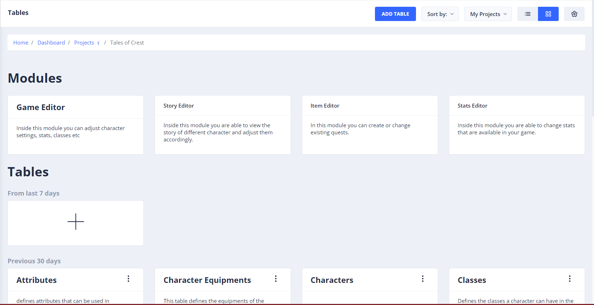
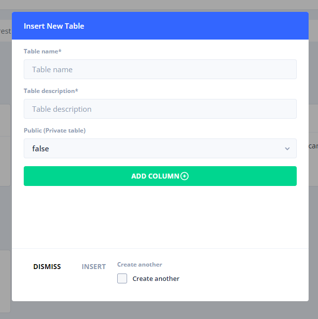

# Tables

For every project that you have created, StoryTime will automatically create tables for you. These tables are what are common in most roleplaying games (RPG). If you have a feature that is new to your game and you want to hold the data in StoryTime you can easily do so.

After creating a project you can click on it and it will show all the tables currently in your project and modules that will get to in a later section.

* Click on the + sign or on "Add Table" at the top.


Whether you choose private or public. An "superAdmin" or "Admin" can still see your table.&#x20;


* Give your new table a name, description.
* Choose whether you want your table to be public or private.
* Check "create another" if you want to stay in form and create more tables.
* Click "insert" to create your table.

