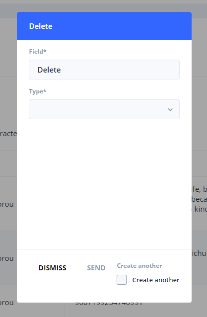

# Columns


Standard columns can't be edited/deleted, since they are part of the StoryTime ecosystem.


### Introduction

In StoryTime, you have tables where the data is stored in. Each piece of data is divided into separate columns. Most of the columns are already defined, but perhaps you want more columns or even want to delete columns.

This is easy to do by pressing the +, pencil, or bin icon on the right.&#x20;


All columns are converted to camel casing to ensure no white spaces.


#### Adding columns

First, the insert functionality has two fields. The first one is the name of your column and the second one is the type of field.

| Field                    | Default Value | Type    |
| ------------------------ | ------------- | ------- |
| Text                     |               | string  |
| Number                   | 0             | integer |
| Bool (Yes or no, 0 or 1) | false         | boolean |

#### Editing columns

The ability to change the column type is on its way.

Second, the update functionality lets you change the name of the column that is already created for your table.

#### Deleting columns

The last functionality is to remove columns. Select a column from the list that you want to delete.

#### Reordering columns


Reordering columns are stored in the local preferences. Once you clear out your data from Chrome you will lose this information as well.


You can reorder columns, by dragging a column left and right.

#### Changing language texts

Every text inside a column has a multilingual value. This means you are able to change the text in your own language (see to [#add-language](../#add-language "mention")). Select the language you want to work with and the columns will be converted to that language.

